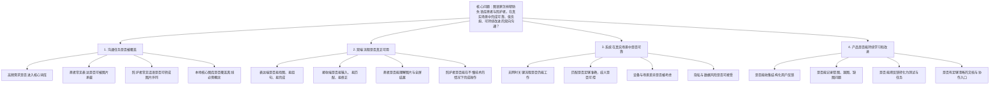
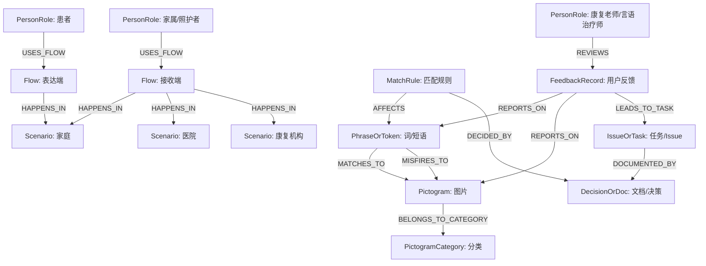

# 图语家项目逻辑树与知识图谱

这份文档分成两部分，而且两部分的目标不同：

- **逻辑树**：用来拆解一个核心问题，强调“单一焦点问题、同层级拆分、尽量不重叠、叶子节点可行动”
- **知识图谱**：用来表达项目中“有哪些实体、它们如何关联、哪些关系需要被记录”

之前如果只是把 README、功能模块、文档入口画成一张“总览图”，那更接近项目地图，不算严格意义上的逻辑树，也不算真正的知识图谱。

## 1. 方法说明

### 1.1 逻辑树的标准做法

逻辑树更接近 issue tree / problem tree 的思路，核心要求是：

- 先定义一个**单一焦点问题**
- 同一层的分支尽量按同一种逻辑拆分
- 分支尽量做到 **MECE-ish**
  - `MECE` = mutually exclusive, collectively exhaustive
  - 对产品问题通常追求“尽量不重叠、尽量覆盖完整”，不必机械追求绝对 MECE
- 叶子节点最好能继续落到：
  - 可验证假设
  - 可执行任务
  - 可收集证据

这类做法常见于咨询、研究设计、复杂问题拆解，而不是知识目录整理。

### 1.2 知识图谱的标准做法

知识图谱不是“把很多概念画出来”就算完成。

更标准的做法是：

- 先定义**用途 / 查询问题**
- 再定义**实体类型**
- 再定义**关系类型**
- 再定义必要的**属性**
- 最后考虑如何随着项目演化而扩展

换句话说，知识图谱更像“面向关系查询的领域模型”，而不是普通脑图。

## 2. 图语家的核心焦点问题

图语家最适合的顶层焦点问题，不是“这个项目有什么模块”，而是：

> **图语家要怎样帮助失语症患者与照护者，在真实场景中完成可靠、低负担、可持续改进的双向沟通？**

这个问题比“产品介绍”更适合拿来做逻辑树，因为它天然要求拆解：

- 什么叫双向沟通
- 什么叫可靠
- 什么叫低负担
- 什么叫可持续改进

## 3. 图语家逻辑树

### 3.1 一级拆分

围绕上面的焦点问题，我建议图语家的一级逻辑拆分如下：

1. **沟通任务是否被覆盖**
2. **双端流程是否真正可用**
3. **系统在真实场景中是否可靠**
4. **产品是否能持续学习和改进**

这四个一级分支，比“功能模块列表”更接近逻辑树，因为它们都在回答同一个顶层问题。

### 3.2 逻辑树总图

### 3.3 二级拆分说明

#### 1. 沟通任务是否被覆盖

这条主线回答的是：

- 图语家有没有覆盖“用户真正需要沟通的事”

不是先问技术，而是先问需求范围。

它可以继续向下变成这些叶子问题：

- 哪些 50 个概念必须离线优先？
- 哪些身体症状必须优先补图？
- 哪些家庭照护动作需要图片支持？
- 哪些常见句式必须被接收端正确处理？

#### 2. 双端流程是否真正可用

这条主线回答的是：

- 即使功能存在，患者和照护者能不能顺利把它用完

可以继续拆成：

- 患者是否找得到图？
- 患者是否看得懂图？
- 家属是否能快速改错？
- 全屏图片序列是否真的帮助理解？

#### 3. 系统在真实场景中是否可靠

这条主线回答的是：

- 产品在家庭、医院、康复机构里能不能稳定工作

可以继续拆成：

- 无网是否还能完成基本沟通？
- 匹配器是否容易出“开心 -> 开心果”这类错误？
- 手机上的触控、语音、全屏、缓存是否稳定？
- 本地数据和云同步是否足够安全？

#### 4. 产品是否能持续学习和改进

这条主线回答的是：

- 图语家有没有形成从真实使用到产品迭代的闭环

可以继续拆成：

- 是否有家属能填写的反馈表？
- 是否有结构化的缺图记录？
- 是否有可执行的 fixture / 测试样本？
- 是否有让外部人能快速加入的文档？

### 3.4 从逻辑树到任务树

逻辑树不是终点，它应该继续下沉到任务。

例如：

- `匹配是否足够准确，歧义是否可控`
  - 建立歧义样本集
  - 把 `label > alias > keyword` 规则固化
  - 加入复合词保护
  - 增加错图反馈记录

- `是否能收集结构化用户反馈`
  - 维护家属反馈表
  - 定义匿名整理模板
  - 建立“反馈 -> issue”映射规则

这才是逻辑树的价值：**从问题拆解到行动拆解**。

## 4. 图语家知识图谱

### 4.1 知识图谱的用途

图语家的知识图谱不该以“好看”为目标，而要以“后续能回答什么问题”为目标。

它至少应该支持这些查询：

1. 某个词、短语、图片、类别之间是什么关系？
2. 某次错图是由哪个 token、哪条规则、哪个图片节点导致的？
3. 某条用户反馈关联到哪些场景、图片、问题类型、任务？
4. 某个文档、决策、任务分别在产品哪条主线上？

### 4.2 核心实体类型

我建议图语家的知识图谱先从 10 类实体开始：

1. `PersonRole`
2. `Scenario`
3. `Flow`
4. `Pictogram`
5. `PictogramCategory`
6. `PhraseOrToken`
7. `MatchRule`
8. `FeedbackRecord`
9. `IssueOrTask`
10. `DecisionOrDoc`

### 4.3 核心关系类型

这些实体之间，最重要的不是“都连一下”，而是定义清楚关系类型。

建议优先定义：

- `USES_FLOW`
- `HAPPENS_IN`
- `BELONGS_TO_CATEGORY`
- `EXPRESSES`
- `MATCHES_TO`
- `MISFIRES_TO`
- `CORRECTED_TO`
- `REPORTED_IN`
- `LEADS_TO_TASK`
- `DOCUMENTED_BY`
- `DECIDED_BY`
- `SUPPORTED_BY_EVIDENCE`

### 4.4 图谱总图

### 4.5 实体属性建议

#### `Pictogram`

建议属性：

- `pictogram_id`
- `label`
- `aliases`
- `keywords`
- `source`
- `license`
- `image_url`
- `priority`
- `is_core_offline`

#### `PhraseOrToken`

建议属性：

- `text`
- `language`
- `phrase_type`
  - single-word
  - compound
  - negation
  - routine-phrase
- `protected_phrase`

#### `MatchRule`

建议属性：

- `rule_name`
- `rule_type`
  - exact-label
  - alias
  - keyword
  - phrase-protection
  - semantic-fallback
- `priority_order`

#### `FeedbackRecord`

建议属性：

- `feedback_id`
- `scenario`
- `original_utterance`
- `wrong_match`
- `expected_match`
- `problem_type`
  - wrong-image
  - missing-image
  - tokenization
  - misunderstanding
- `must_work_offline`
- `anonymized`

### 4.6 图语家的知识图谱边界

一个重要最佳实践是：**先画边界，再扩图谱**。

图语家当前最适合的图谱边界不是“整个医疗康复知识世界”，而是：

- 图片词库与匹配
- 用户反馈与问题归因
- 场景与流程
- 文档与任务关系

暂时不建议一上来就把下面这些全部拉进来：

- 全部医学知识
- 全部卒中康复知识
- 全量 AAC 国际标准
- 全量家庭照护知识

否则图会很大，但对当前产品推进帮助不大。

## 5. 当前文档体系中的定位

这份文档在现有文档树里，应该承担的是：

- 作为 `README` 和 `PRD` 之上的结构总览
- 作为 `decision-index`、`implementation-task-index`、`user-research-playbook` 之间的桥
- 作为后续做幻灯片、拉协作者、做项目说明时的“结构首页”

与其他文档的关系：

- `README`：介绍项目是什么
- `prd.md`：介绍产品目标和范围
- `decision-index.md`：记录做了哪些关键决策
- `implementation-task-index.md`：记录怎么做
- **本文**：说明这些内容在同一张结构图里如何关联

## 6. 当前更符合最佳实践的使用方式

### 6.1 逻辑树用法

建议在讨论产品方向、优先级、路线图时使用这份逻辑树。

不建议：

- 把它写成纯功能清单
- 把不同层级混在一起
- 一层里同时放“目标、功能、技术、文档”

### 6.2 知识图谱用法

建议在下面场景里使用：

- 梳理图片词库结构
- 记录错图和修正关系
- 把用户反馈串到任务和文档
- 规划后续数据模型时统一概念

不建议：

- 把它当普通思维导图
- 不定义关系类型，只是随便连线
- 一上来做全量领域知识库

## 7. 下一步还可以继续补的图

如果后面继续完善，建议优先补这三类图，而不是继续堆概念：

1. **接收端错图归因图**
   - 原话
   - token
   - 触发规则
   - 命中图片
   - 家属修正结果

2. **核心词库覆盖图**
   - 场景
   - 高频需求
   - 当前是否已有本地图
   - 是否离线必需

3. **反馈闭环图**
   - 家属反馈
   - 匿名整理
   - issue
   - 实现任务
   - fixture / test
   - 文档更新

## 8. 参考的更标准做法

我这次重写主要参考了这些方法要点：

- 逻辑树 / issue tree：
  - 单一 focus question
  - 分层拆分
  - 尽量 MECE
  - 叶子节点能落到行动或证据

- concept map：
  - 概念节点之间必须有**明确关系词**
  - 不是只列名词

- knowledge graph modeling：
  - 先定义 use case
  - 再定义 entity / relationship / property
  - 从小范围开始，逐步演化
